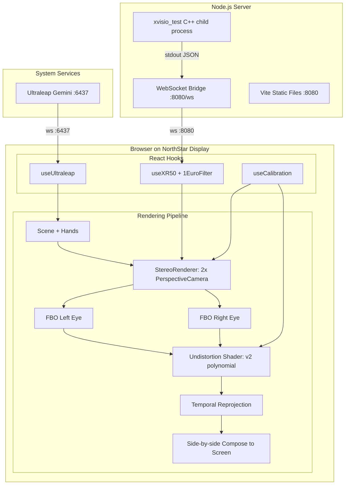

# Vibestar: NorthStar R3F Rewrite

## Context

The current [visual-test/](visual-test/) directory contains 4 disconnected vanilla Three.js pages with no undistortion, no pose prediction, no temporal re-projection, and hardcoded calibration values. We will rewrite it as a single Vite + React Three Fiber application implementing the full Project Esky rendering pipeline described in the paper.

**Important:** Use the Context7 MCP server (`resolve-library-id` then `query-docs`) to look up the latest documentation for every library before writing code that uses it. Libraries to look up: `react-three-fiber`, `drei`, `postprocessing`, `react-postprocessing`, `uikit` (pmndrs), `vite`, `zustand`, `three.js`.

## Architecture



## Project Structure

All new files go inside `visual-test/`. The old `.html` and `.js` files will be deleted and replaced.

```
visual-test/
  index.html
  package.json
  tsconfig.json
  vite.config.ts
  server.ts                    # XR50 WebSocket bridge (modernized)
  public/
    calibration/
      EskySettings.json        # Copied from project-esky-unity/
  src/
    main.tsx                   # React entry point
    App.tsx                    # Route: /desktop vs /headset
    stores/
      tracking.ts              # Zustand store for pose + hand data
    hooks/
      useXR50.ts               # XR50 WebSocket + 1-euro filter
      useUltraleap.ts          # Ultraleap WebSocket
      useCalibration.ts        # Load + parse EskySettings.json
    lib/
      one-euro-filter.ts       # 1-euro filter implementation
      calibration.ts           # Parse JSON to Three.js matrices
      transforms.ts            # Coord space conversions (Leap to scene)
    components/
      NorthStarRenderer.tsx    # Stereo FBO + undistortion + compose
      DesktopPreview.tsx       # Debug 3D view with OrbitControls
      Hands.tsx                # Ultraleap hand joint visualization
      Scene.tsx                # Shared demo scene content
      HUD.tsx                  # Status overlay via @react-three/uikit
    shaders/
      undistortion.glsl        # v2 polynomial UV warp per eye
      reprojection.glsl        # Planar temporal re-projection
```

## Key Calibration Data

From [project-esky-unity/EskySettings.json](project-esky-unity/EskySettings.json):

- `v2CalibrationValues`: 16 polynomial coefficients per axis per eye (4 arrays of 16 floats) for the undistortion shader
- `v1CalibrationValues`: per-eye `eyePosition`, `cameraProjection` (asymmetric frustum bounds), `worldToScreenSpace` (4x4 matrix)
- `myOffsets.TranslationEyeToLeapMotion` / `RotationEyeToLeapMotion`: Leap-to-eye extrinsic transform
- `displayWindowSettings`: 2880x1600, eye texture 1600x1440

## Implementation Steps

Steps are ordered so each one is independently testable via the browser. The agent should use the Cursor browser connection to visually verify each step before moving on.

### Step 1: Scaffold Vite + R3F project

Delete old files (`index.html`, `main.js`, `hands.html`, `hands.js`, `combined.html`, `combined.js`, `northstar.html`, `northstar.js`, `style.css`). Keep `server.js` temporarily. Create the Vite + React + TypeScript + R3F project with dependencies:

- `react`, `react-dom`
- `three`, `@react-three/fiber`, `@react-three/drei`, `@react-three/uikit`
- `@react-three/postprocessing`, `postprocessing`
- `zustand`
- `ws` (server-side)
- `vite`, `@vitejs/plugin-react`, `typescript`

**Acceptance:** App renders a spinning cube in the browser at `http://localhost:5173`. No errors in console.

### Step 2: WebSocket hooks + 1-euro filter + Zustand store

Implement:

- `one-euro-filter.ts` -- the 1-euro filter (speed-adaptive low-pass: ~50 lines)
- `tracking.ts` -- Zustand store holding `headPose`, `leftHand`, `rightHand`, connection states
- `useXR50.ts` -- connects to `ws://localhost:8080`, parses JSON, runs pose through 1-euro filter, updates store
- `useUltraleap.ts` -- connects to `ws://localhost:6437/v6.json`, parses hand frames, updates store

**Acceptance:** With xvisio_test + server.js running, open browser, check console/HUD: XR50 pose data streaming and filtered (smooth values), Ultraleap hand data visible in store. Connection status indicators show green.

### Step 3: Desktop preview mode

Implement:

- `DesktopPreview.tsx` -- scene with OrbitControls, headset avatar mesh, grid, axis helper
- `Hands.tsx` -- joint spheres + palm spheres from Ultraleap data with proper coordinate transform using `TranslationEyeToLeapMotion` offset
- `Scene.tsx` -- shared demo content (grid, floating cubes, lighting)
- `HUD.tsx` -- uikit overlay showing connection states, FPS, pose values

**Acceptance:** At `http://localhost:5173/` (desktop mode), a 3D scene shows the headset avatar moving with XR50 data and hand joints tracking with Ultraleap. OrbitControls work. HUD shows live telemetry.

### Step 4: Calibration loader

Implement:

- `calibration.ts` -- parse `EskySettings.json` into typed structures; build Three.js `Matrix4` from `worldToScreenSpace`; build asymmetric `PerspectiveCamera` frustum from `cameraProjection` (left, right, bottom, top); extract polynomial coefficients as `Float32Array`
- `useCalibration.ts` -- hook that fetches `/calibration/EskySettings.json` and returns parsed calibration

**Acceptance:** Console logs the parsed calibration on load: two eye positions (~plus/minus 30mm X), two asymmetric projection matrices, 64 polynomial coefficients, Leap extrinsic offset.

### Step 5: NorthStar stereo renderer

Implement:

- `NorthStarRenderer.tsx` -- the core stereo pipeline:
  - Two `PerspectiveCamera` instances with asymmetric frustums from calibration (`camera.projectionMatrix.makePerspective(left, right, top, bottom, near, far)`)
  - Camera rig group moved by filtered XR50 pose
  - `useFBO` from drei for each eye (1440x1600 render targets)
  - `useFrame` renders scene to each FBO, then composes side-by-side to screen using a fullscreen quad with two texture samplers
  - Keyboard controls: F = fullscreen, H = hide HUD, M = mirror toggle

Route: `http://localhost:5173/headset` renders this mode.

**Acceptance:** Browser shows a side-by-side stereo view (left half / right half). Moving the XR50 moves the viewpoint. Each eye shows slightly different perspective (IPD offset visible). Pressing F enters fullscreen. On the NorthStar display, the stereo image fills the screen.

### Step 6: Undistortion shader

Implement:

- `undistortion.glsl` -- fragment shader that takes a rendered eye texture and the 16 polynomial coefficients, evaluates `rect = polynomial(uv)`, samples the texture at the warped UV
- Integrate as a custom `Effect` from the postprocessing library, applied per-eye before composition
- Coefficients loaded from calibration for left and right eye separately

The polynomial (from EskySettings v2):

```
rect.x = sum of c[i] * u^a * v^b for the 16 monomial terms
rect.y = same with y coefficients
```

**Acceptance:** When undistortion is enabled, the stereo image shows visible barrel/pincushion warping (pre-correction for the NorthStar optics). Toggling undistortion on/off shows the difference. Through the NorthStar optics, straight lines should appear straighter with undistortion on.

### Step 7: Temporal re-projection

Implement:

- `reprojection.glsl` -- fragment shader that takes the rendered frame, the render-time head pose, and the latest head pose, computes a 2D homography (planar assumption from the paper), and warps the frame
- Track `renderPose` vs `displayPose` timestamps in the store
- Apply as a final pass after undistortion

**Acceptance:** During fast head rotation, virtual content should appear more stable and less "swimmy" with re-projection enabled vs disabled. Can be A/B tested by toggling.

### Step 8: Server modernization + launch script

Modernize `server.ts`:

- Spawn `xvisio_test` as child process
- Serve the Vite production build as static files
- WebSocket endpoint for XR50 data
- Single command: `npm start` (with sudo for USB)

**Acceptance:** Running `sudo npm start` from `visual-test/` starts everything. Opening `http://localhost:8080` in a browser on the NorthStar display shows the full stereo AR experience with undistortion, hand tracking, and 6DOF head tracking. Opening `http://localhost:8080` on a desktop shows the debug preview.